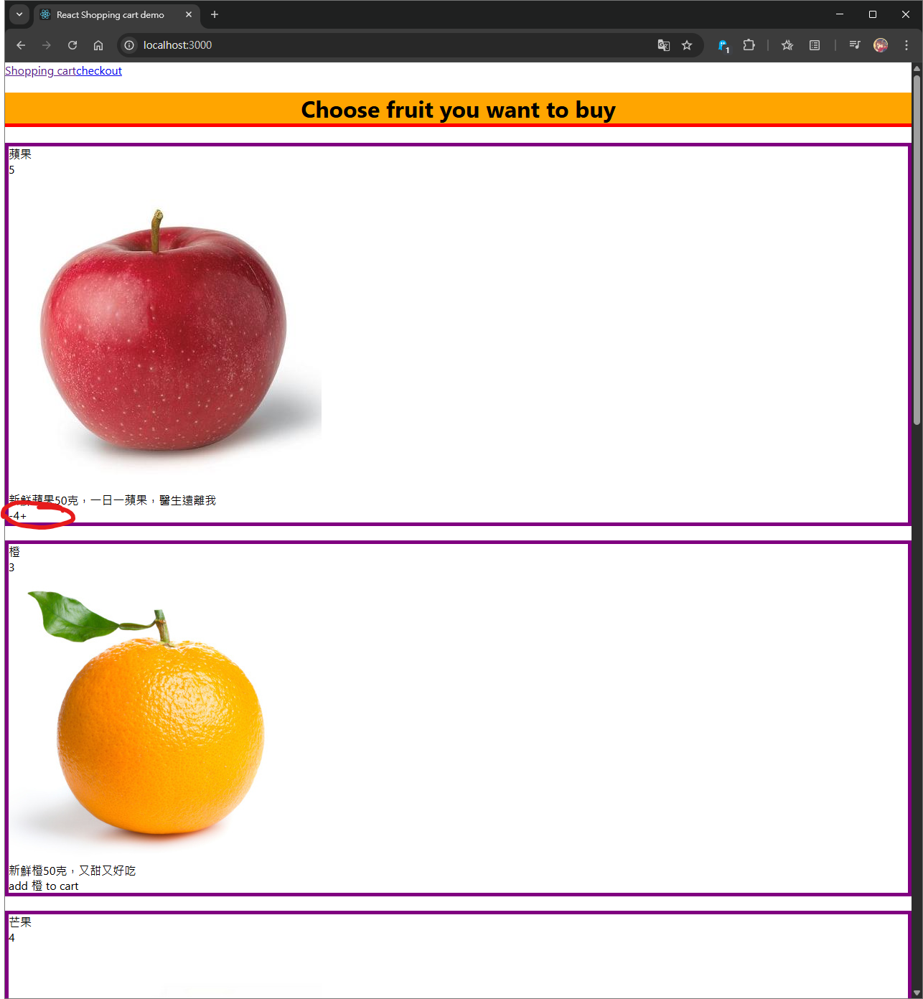
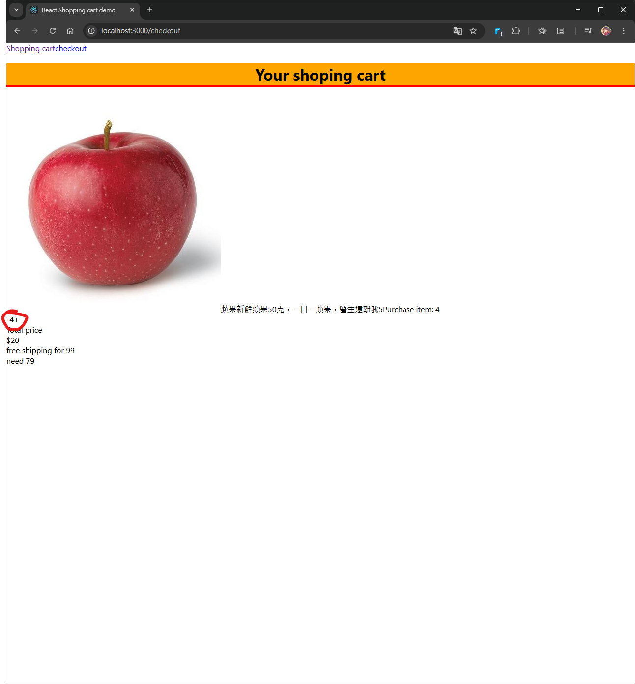

# React shopping cart project (abandoned, finished logic and simple layout design)

build a simple react shopping cart single page application using react major functionality

## Major goal:

1. get used to frontend deveopment
2. try react keys features (e.g. JSX, React Route, Props, useState and useEffect)
3. debug using chrome React Development tools

## App Key features

1. fetched commodity list
2. shared button (to control the quantity of ordered goods) on different pages of website (on goods display page and checkOut page)

## further improvement

1. miss of css and layout design (maybe wait until I learn css framework)

## image

